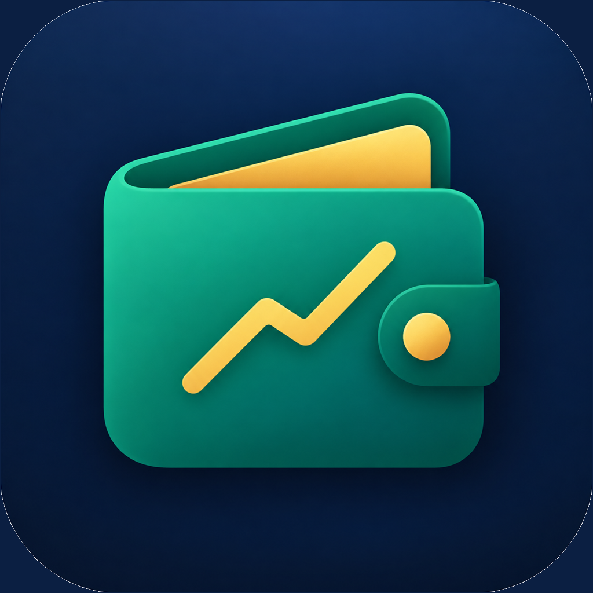

# Pocket Ledger

Pocket Ledger is a small, local-only SwiftUI proof of concept for validating an iOS development and sideloading workflow from Windows 11 while shaping a personal finance product for Lebanon. It is intentionally an MVP validation app, not a production finance product.

The public app name is **Pocket Ledger**. The internal Xcode target, source directory, bundle IDs, and IPA filename remain **FinanceDemo** so free-Apple-ID testing keeps stable identifiers between builds.

The Windows machine does not compile iOS code. GitHub Actions provisions a GitHub-hosted macOS runner, installs XcodeGen, generates the Xcode project from `project.yml`, compiles an unsigned device build, verifies the embedded widget extension, and uploads `FinanceDemo-unsigned.ipa` as a short-lived artifact.

## Architecture

- `FinanceDemo/App`: SwiftUI app entry point, ledger store, finance views, and the app-only Siri/Shortcuts provider.
- `FinanceDemo/Models`: shared snapshot model plus the multi-currency finance domain model.
- `FinanceDemo/Services`: App Group storage, finance data storage, app-lock security, Foundation Models, and local notification services.
- `FinanceDemo/Shared`: App Intents shared by the main app and widget for finance-ledger actions.
- `FinanceDemoWidget`: one WidgetKit extension with `systemSmall` and `systemMedium` layouts.
- `FinanceDemo/Config` and `FinanceDemoWidget/Config`: App Group entitlement files and generated Info.plist destinations.
- `FinanceDemo/Resources/Assets.xcassets`: the Pocket Ledger app icon.
- `.github/workflows/ios-build.yml`: manually triggered unsigned build and IPA packaging workflow.

XcodeGen is used so the project configuration stays declarative and the generated `.xcodeproj` does not need to be committed. CI runs `brew install xcodegen` followed by `xcodegen generate`.

## Finance product slice

The main app now contains the first local finance workflow for the Lebanese market:

- USD and LBP are stored as integer minor units, so LBP values do not use floating-point rounding.
- A single transaction can record a bill total, multiple outflows from different accounts, multiple inflows, and a custom exchange rate.
- Change can be returned to a different account and currency. Requested change and actual change are both retained, so denomination shortfalls such as 460,000 LBP requested and 450,000 LBP returned remain visible.
- Starter options include cash, bank-account, and loan account types plus parent categories and subcategories; the first-launch wizard is skippable and a fresh ledger stays empty until the user creates data.
- The Overview tab reports available balances by currency, monthly expenses by currency, transaction count, and the most-used category.
- Transactions can be searched, edited, duplicated, and deleted from the history surface.
- Category budgets can be created, edited, and reviewed from both Overview and More, with monthly progress and over-budget states.
- Transactions can be saved as reusable templates and used to prefill a new entry.
- Scheduled transactions can opt into local due-date reminders; ledger entries are still materialized when the app returns to the foreground.
- First launch offers a skippable setup wizard; quick entry remembers recent account/category choices and can create accounts or categories inline.
- Accounts and categories can be edited, archived, and restored. Archived records stay available to historical transactions but are excluded from new-entry pickers; `includeInTotals` remains independent.
- Transaction drafts are centrally validated for missing or archived references, currency mismatches, invalid amounts, same-currency transfer imbalance, and missing cross-currency rates.
- Transaction history supports direct tap-to-edit, visible swipe actions, and dashboard-to-history “See all” navigation.
- The widget and Shortcuts read and mutate the same shared finance ledger as the main app.
- A native Control Center/Lock Screen control records the existing quick USD expense action after device authentication.
- The Control Center action can be configured with a USD amount; the widget keeps a separate fixed quick-expense preset.

The current slice is local-only and intentionally keeps currency totals separate. It records the exchange rate for each mixed-currency transaction but does not yet convert all historical balances into one net-worth number.

## Data import and backup

Settings → Import & Backup supports several migration paths:

- Full `.pocketledger` backups are versioned and include local receipt photos/PDFs plus extracted receipt line items and totals. They can be merged into the current ledger or used to replace it.
- JSON backups remain available as a compatibility format; they preserve ledger metadata but cannot carry local attachment bytes.
- CSV, TSV, and JSON row exports open a field-mapping screen. Date and amount are required; type, currency, account, destination account, category, and note can be mapped or supplied with defaults.
- `.xlsx` workbooks are read on-device, including multiple sheets. The importer also recognizes the Money Manager-style export used by `2026-09-01 ~ 09-30.xlsx`, combines category/subcategory and note/description fields, and reconstructs paired same-time transfers, including USD-to-LBP amounts when the account names identify the currencies.
- SQLite backups such as Money Manager `.mmbak`, `.sqlite`, `.sqlite3`, and `.db` files expose their tables for mapping and include a normalized Realbyte table when the known transaction tables are present.

Legacy binary `.xls` files should be saved as `.xlsx`, CSV, or TSV before importing. External files are parsed locally and are not sent to a server. Imported rows are added with new IDs, while Pocket Ledger backup restore preserves its original IDs.

Stable identifiers are intentionally used for every build:

- Main app: `com.josephlteif.financedemo`
- Widget: `com.josephlteif.financedemo.widget`
- App Group: `group.com.josephlteif.financedemo`

The minimum deployment target is iOS 26.0. The demo uses SwiftUI, WidgetKit, AppIntents, UserNotifications, Foundation, and Foundation Models. Foundation Models is entirely on-device; this project does not use OpenAI, Gemini, Claude, Firebase, Supabase, or another backend.

## Branding

Pocket Ledger uses a dark navy, teal, emerald, and warm gold wallet/ledger mark. The source icon is stored at `FinanceDemo/Resources/Assets.xcassets/AppIcon.appiconset/AppIcon-1024.png` and is included in the main app target through XcodeGen. The internal `FinanceDemo` names are deliberate implementation details and should not be renamed during free-signing tests.

## GitHub Actions build

The workflow uses `macos-26` GitHub-hosted runners and prints the macOS, Xcode, and Swift versions used for the release build. The iOS app build, watch builds, and simulator tests run in parallel; a final job verifies the bundles and packages the IPA. It is intentionally not triggered for ordinary pushes to `main`.

Swift Package data is cached between runs, and the generated Xcode project is recreated in each job from `project.yml`.

To build:

1. Open the repository on GitHub.
2. Open **Actions** → **Build unsigned iOS IPA**.
3. Choose **Run workflow** on `main`.
4. Open the completed run and download the `FinanceDemo-unsigned` artifact.

The artifact contains:

- `FinanceDemo-unsigned.ipa`
- `build-info.txt` with the Xcode version, Swift version, commit SHA, and UTC build time.

The IPA is unsigned. Do not use `xcodebuild -exportArchive` for this workflow: exporting requires signing material. CI uses `CODE_SIGNING_ALLOWED=NO` and packages the verified `.app` manually under `Payload/`.

## Windows sideloading setup

The primary route is AltStore Classic through AltServer on Windows. Sideloadly is a secondary fallback. Both use a free Apple ID; a free sideloaded app normally expires after 7 days, so refresh it before expiry. Free accounts also have Apple-imposed limits on simultaneously sideloaded apps and App IDs.

Official installation references:

- AltStore Windows instructions: <https://faq.altstore.io/altstore-classic/how-to-install-altstore-windows>
- Sideloadly: <https://sideloadly.io/>

AltStore’s Windows instructions require the latest iTunes and iCloud packages downloaded directly from Apple rather than the Microsoft Store versions for the standard setup. Sideloadly documents the same web-installed iTunes/iCloud requirement. Do not uninstall existing Apple software automatically: first identify whether the installed package is the Microsoft Store version, and decide which Apple software you want to keep.

AltStore installation and IPA installation are separate steps. First install AltStore itself through AltServer; only after AltStore is working should you import the unsigned Pocket Ledger IPA.

After the software prerequisites are correct, the manual device steps are:

1. Install AltServer from the official AltStore Windows download and run it as administrator.
2. Connect the iPhone to the PC by USB while it is unlocked.
3. Tap **Trust** on the iPhone and accept the Windows trust prompt if shown.
4. Enable **Settings → Privacy & Security → Developer Mode** on the iPhone, then restart if iOS requests it.
5. Open iTunes and enable Wi-Fi sync for the iPhone if Wi-Fi refresh is desired.
6. Use AltServer’s **Install AltStore** menu to install AltStore itself, then authenticate directly in AltServer with the Apple ID. Never put the Apple ID password in this repository, GitHub, a script, or chat.
7. Trust the developer profile in **Settings → General → VPN & Device Management** if iOS asks for it.
8. Download the completed `FinanceDemo-unsigned.ipa` artifact from GitHub Actions.
9. Open/share the IPA into AltStore and let AltStore sign/install Pocket Ledger.
10. Refresh the app from AltStore before the free 7-day signing window expires.

Sideloadly follows the same no-paid-membership principle: load the IPA, select the connected iPhone, authenticate directly in Sideloadly, and sideload. Its official FAQ also documents Wi-Fi pairing and the 7-day free-account window.

## Entitlements and App Groups

Both the main app and the widget declare only this entitlement:

`com.apple.security.application-groups = [group.com.josephlteif.financedemo]`

When the App Group is available, the app and widget use a SwiftData-backed SQLite database at `PocketLedger.sqlite` inside that shared container. The database contains one durable typed ledger record, is shared across the main app, widget, and App Intents, and starts empty on a fresh install. If a sideloading service strips the App Group entitlement, the main app and App Intents fall back to their own persistent Application Support SQLite database; this remains durable across launches, but cannot be shared with the widget. The widget reports the shared-container limitation instead of pretending it has the app's data.

The storage notice reports either:

- `Persistent database is working`
- `Persistent local database is working; widget sharing is unavailable`
- `Persistent database unavailable`

The unavailable and undecodable states reject normal writes; an explicit restore or reset is required to replace corrupted data. Third-party free signing is the highest-risk part of this proof of concept: it may strip, reject, or fail to preserve App Group capabilities, in which case the main app remains persistent but widget sharing requires a properly provisioned App Group.
A successful GitHub build proves compilation and embedding only; it does not prove App Groups work on the physical iPhone.

## Finance acceptance checklist

Complete this on the physical iPhone after installation:

- [ ] Launch the app.
- [ ] Confirm the fresh database starts with no seeded accounts, categories, or transactions.
- [ ] On first launch, skip setup and confirm the ledger remains empty; reopen **More → Setup guide**, create an account, and optionally add starter categories.
- [ ] Add accounts and confirm the Overview tab shows separate USD and LBP balances.
- [ ] From quick entry, create an account and category inline, save an expense, then confirm the next entry remembers the recent choices.
- [ ] Tap an account, confirm its account-specific transaction history opens, and reconcile its balance once as a counted transaction and once without creating a transaction.
- [ ] Open Metrics and verify month, year, custom-date, and category filters update the totals.
- [ ] Add an expense with a `$10` bill total, `$9 paid from a USD cash account, and `90,000 LBP` paid from an LBP cash account.
- [ ] Add `450,000 LBP` returned to an LBP account, enter `460,000 LBP` as requested change, and confirm the transaction shows the denomination shortfall.
- [ ] Reopen the app and confirm the transaction and account balances persist.
- [ ] Add a bank account, loan account, top-level category, and subcategory.
- [ ] Edit an account/category, archive it, confirm it disappears from new-entry pickers, and confirm its historical transactions still render.
- [ ] Tap a transaction row to edit it, use swipe actions, and open the full history through **See all**.
- [ ] Scan or import a receipt photo/PDF, review extracted line items before saving, open the saved attachment, replace/delete it, and confirm a missing local file shows an unavailable state instead of crashing.
- [ ] Export a full `.pocketledger` backup, reset or use a second install, restore it, and verify transactions and receipt attachments return.
- [ ] Add the Pocket Ledger widget and confirm it shows separate USD and LBP balances.
- [ ] Use the widget quick action or the Pocket Ledger expense Shortcut and confirm the new expense appears in Transactions.
- [ ] Run the balance Shortcut and confirm it returns both USD and LBP balances.
- [ ] Refresh/re-sign the app without deleting it; confirm the state remains.
- [ ] Record whether shared App Group storage is `WORKING` or `UNAVAILABLE` during device validation.
- [ ] Verify receipt files persist in the App Group (or local fallback), full-backup restore works, and lock-screen/widget surfaces do not reveal more data than intended.
- [ ] In Settings, set a 4-to-6 digit app passcode, background the app, and confirm the lock screen appears when it is reopened.
- [ ] Enable biometric unlock in Settings and confirm Face ID or Touch ID unlocks the app.

## Troubleshooting

### GitHub build fails

Open the failed run and inspect the raw `xcodebuild` output. The workflow stops on XcodeGen generation errors, Swift compiler errors, a missing `FinanceDemo.app`, a missing `PlugIns` directory, a missing `.appex`, or a missing IPA.

If Foundation Models symbols change in a newer runner SDK, update `FoundationModelService.swift` against the installed SDK’s compiler errors. The current implementation uses `SystemLanguageModel.default.availability`, handles available, disabled, ineligible, not-ready, and other unavailable states, then creates a local `LanguageModelSession` only when available.

### AltServer cannot see the iPhone

Use the web-installed iTunes and iCloud packages, keep iTunes/iCloud running, connect the unlocked iPhone by USB, tap **Trust**, and run AltServer as administrator. Bonjour is also needed for Wi-Fi discovery. If an existing Microsoft Store Apple package conflicts, resolve that installation choice manually before removing anything.

### App Group says UNAVAILABLE

Reinstall the exact same stable bundle identifiers with the same Apple ID, verify both entitlement files still contain the same App Group, and inspect device logs for the `main-app`, `widget`, and `app-intent` contexts. Do not treat a widget showing a value from its placeholder as proof of shared storage. Free third-party signing may strip, reject, or fail to preserve App Groups; only the physical-device checklist can validate this path.

### App expires

Free Apple signing is time-limited. Refresh/re-sign from AltStore or Sideloadly before the 7-day window ends. Re-signing should use the same Apple ID and bundle identifiers if you want to preserve the app’s data, but the App Group result must still be verified on the device.

## Security

Pocket Ledger supports an optional app lock from the Settings tab. The passcode is never stored in the ledger or App Group data: the app stores a salted SHA-256 verifier in a device-only Keychain item, and locks the app again when it enters the background. Face ID, Touch ID, or Optic ID can be enabled as a convenience unlock after a passcode is configured.

The lock protects the main app surface. Widgets are separate system surfaces and may continue to display their configured balance, so users should remove the widget if those balances should not be visible outside the app.

This repository intentionally contains no Apple password, session token, certificate, provisioning profile, private key, `.p12`, GitHub token, or generated credential file. GitHub Actions performs an unsigned build and never contacts Apple provisioning services.
